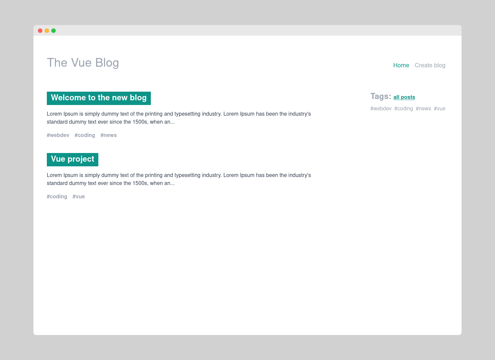

# Mini Blog Vue Application w/ composition API 
* lists all blogposts
* can see details of the post
* different tags that can filter the blogs (show blogs only with that tag)
* TODO: everyone can create a new post
* TODO: everyone can delete any post
## Project setup
```
yarn install
```

### Compiles and hot-reloads for development
```
yarn serve
```

### Compiles and minifies for production
```
yarn build
```

### Lints and fixes files
```
yarn lint
```
